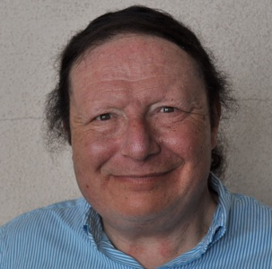
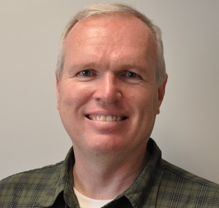
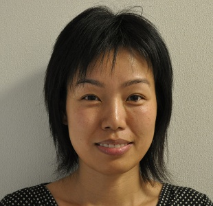
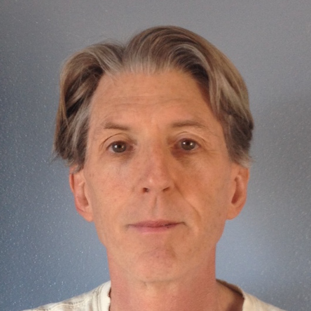
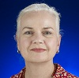

## Listing of __Full-Time Faculty__

 
<a href="http://cse.csusb.edu/concep">Dr. Arturo I. Concepcion</a> 
Professor 
Office: JB 343 
Phone: (909) 537-5330 
Email: concepcsusb.edu 

 
<a href="http://cse.csusb.edu/georgiou/">Dr. George M. Georgiou</a> 
Professor 
Office: JB 307 
Phone: (909) 537-5326 
Email: georgioucsusb.edu 

 
<a href="http://cse.csusb.edu/egomez">Dr. Ernesto Gomez</a> 
Professor 
Office: JB 337 
Phone: (909) 537-5429 
Email: ernestocsusb.edu 

 
<a href="http://cse.csusb.edu/ykarant">Dr. Yasha Karant</a> 
Professor 
Office: JB 344 
Phone: (909) 537-5329 
Email: ykarantcsusb.edu 

 
Dr. Josephine Mendoza 
Professor 
Office: JB 342 
Phone: (909) 537-5331 
Email: jmendozacsusb.edu 

 
<a href="http://cse.csusb.edu/murphy">Dr. Owen J. Murphy</a> 
Professor 
Office: JB 345 
Phone: (909) 537-5408 
Email: murphycsusb.edu 

 
<a href="http://cse.csusb.edu/hqiao">Dr. Haiyan Qiao</a> 
Associate Professor 
Office: JB 341 
Phone: (909) 537-5415 
Email: hqiaocsusb.edu 

 
<a href="http://cse.csusb.edu/turner">Dr. David A. Turner</a> 
Professor 
Office: JB 340 
Phone: (909) 537-5428 
Email: dturnercsusb.edu 

 
<a href="http://cse.csusb.edu/voigt">Dr. Kerstin Voigt</a> 
Director and Professor 
Office: JB 349 
Phone: (909) 537-5333 
Email: kvoigtcsusb.edu 

 
<a href="http://cse.csusb.edu/tongyu">Dr. Tong Lai Yu</a> 
Professor 
Office: JB 346 
Phone: (909) 537-5334 
Email: tyucsusb.edu 

 
<a href="http://cse.csusb.edu/kay">Dr. Kay Zemoudeh</a> 
Professor 
Office: JB 347 
Phone: (909) 537-5348 
Email: kaycsusb.edu 

