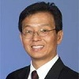

# Part-Time Faculty

  
<strong>Mr. Ken Han</strong>  
Lecturer  
Office: UH-047  
Phone: (909) 537-7598  
Email: khancsusb.edu
 

  
<strong>Mr. Peter Watson</strong>  
Lecturer  
Office: JB 336  
Phone: (909) 537-7231  
Email: pwatsoncsusb.edu
 
 

  
<strong>Ms. Kathleen R. Devlin</strong>  
Lecturer  
Office: JB 336  
Phone: (909) 537-7231  
Email: kdevlincsusb.edu  
Web: <a href="http://kdevlin.com/" title="http://kdevlin.com/">http://kdevlin.com/</a>
 

<!--

  
<strong>Ms. Jane Curnutt</strong>  
Lecturer  
Office: JB 542  
Phone: (909) 537-3608  
Email: jcurnuttcsusb.edu  
-->

  
<strong>Ms. Taline Georgiou</strong>  
Lecturer  
Office: JB 338  
Phone: (909) 537-5332  
Email: tgeorgiocsusb.edu  
<!--Web: <a href="/tgeorgiou/" title="Taline Georgiou">http://cse.csusb.edu/</a-->
 

